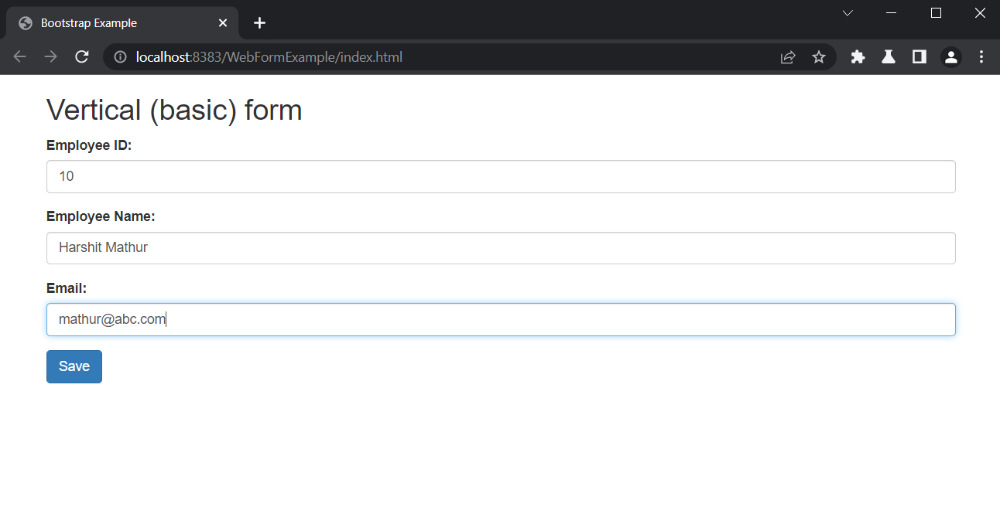
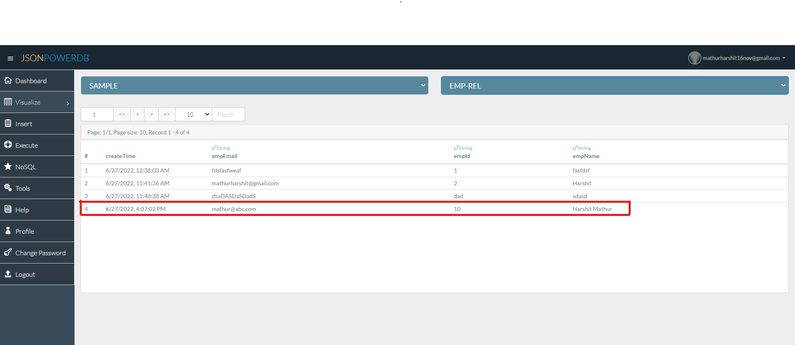

# JsonPowerDB
## Description
This project is about saving data in JPDB from HTML form.
**JsonPowerDB** is a powerful, lightweight, and easy-to-use real-time REST API-based multimode DBMS. JsonPowerDB has ready-to-use APIs for Json Document DB, RDBMS, Key-Value DB, GeoSpatial DB, and TimeSeries DB features. JPDB supports and advocates true serverless and pluggable API development.

## Benefits of using JsonPowerDB
- It is raw form of data and readable by human.
- It reduces the overall development cost and helps developer in coding fast.
- It has simplified method to retrieve data in JSON format.
- Data is indexed in real-time using PowerIndex engine.
## Illustration
- Database name : SAMPLE
- Database relation : EMP-REL
#### Adding details

#### Visualising in **JPDB**

## Release Notes
### June 27, 2022
#### First JPDB Project
- Saving data from the HTML form in JPDB.
- Used JPDB commons js library for easy and fast development.
